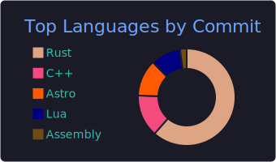

# hey, i'm logan

i'm a systems programmer who loves building things in rust.

currently working on:
- [**rungine**](https://github.com/code-prose/rungine) — a TF-IDF search engine built from scratch in rust, with PDF parsing, a custom lexer, and diesel-backed storage
- [**s3tree**](https://github.com/code-prose/s3tree) — a rust project for working with S3

upcoming:
- [**crafting interpreters**](https://github.com/code-prose/loxan).

i also enjoy competitive programming ([advent of code](https://github.com/code-prose/advent-of-code-2025)) and working through language deep-dives like [rustlings](https://github.com/code-prose/rustlings)

## languages

  

## editor

i use [neovim](https://neovim.io) as my daily driver.

my config is written in lua and lives in my [dotfiles](https://github.com/code-prose/dots). the full setup includes alacritty, tmux, tmux-sessionizer, and zsh — all tuned for a keyboard-driven workflow.

  
  
  

